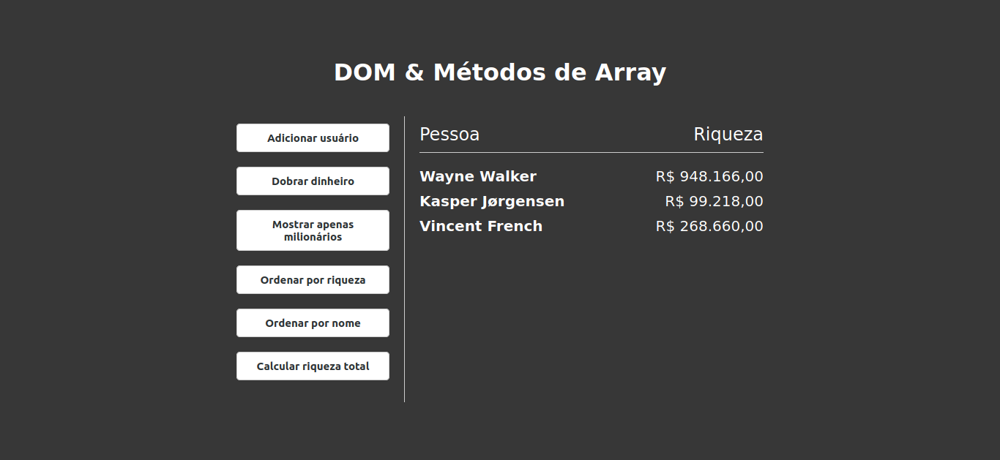

# dom-array-methods

## Project

***EN:*** This is a little project to practice the use of array methods and manipulation/organization of DOM elements.

***PT-BR:*** Um pequeno projeto para praticar o uso de métodos de array e manipulação/organização de elementos do DOM.

### Specifications
- Fetch random users from the randomuser.me API
- Use forEach() to loop and output user/wealth
- Use map() to double wealth
- Use filter() to filter only millionaires
- Use sort() to sort by wealth and by name
- Use reduce() to add all wealth
***

## Technologies

This project was developed with the following technologies:

- HTML
- CSS
- JavaScript
***
 
## Preview

***

## License

This project is under the MIT license.
